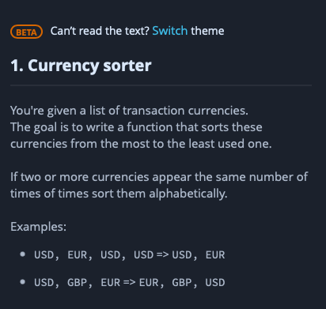

Currency sorter

You're given a list of transaction currencies.
The goal is to write a function that sorts these currencies from the most to the least used one.
If two or more currencies appear the same number of times of times sort them alphabetically.
Examples:
• USD, EUR, USD, USD => USD, EUR
• USD, GBP, EUR => EUR, GBP, USD

